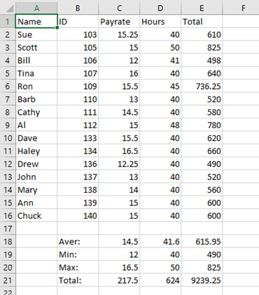
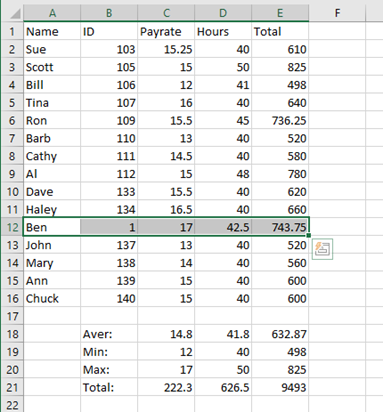
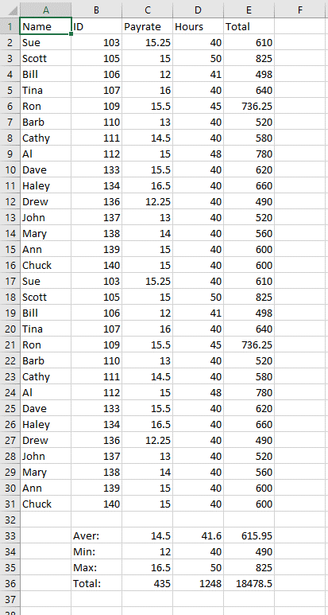

# Payroll-with-Excel-VB-Automation
Simple payroll system that reaches out to an installed instance of Excel for payroll processing.

Original run:

Modified Excel data:

Modified run (doubled employees in list):

